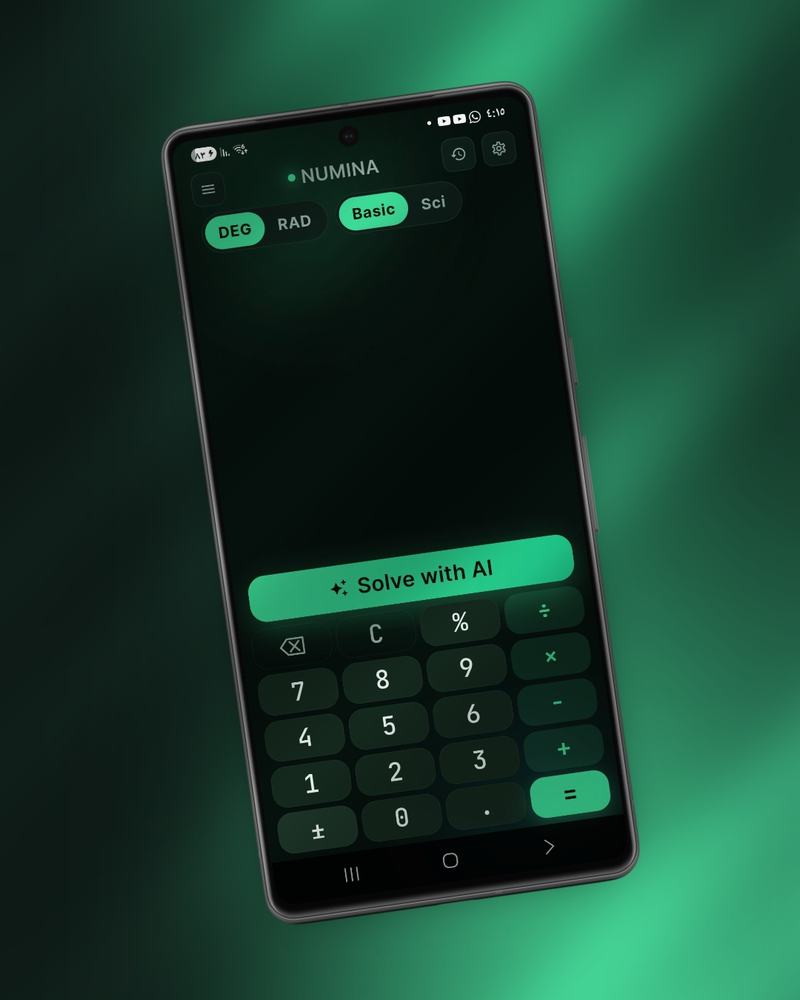
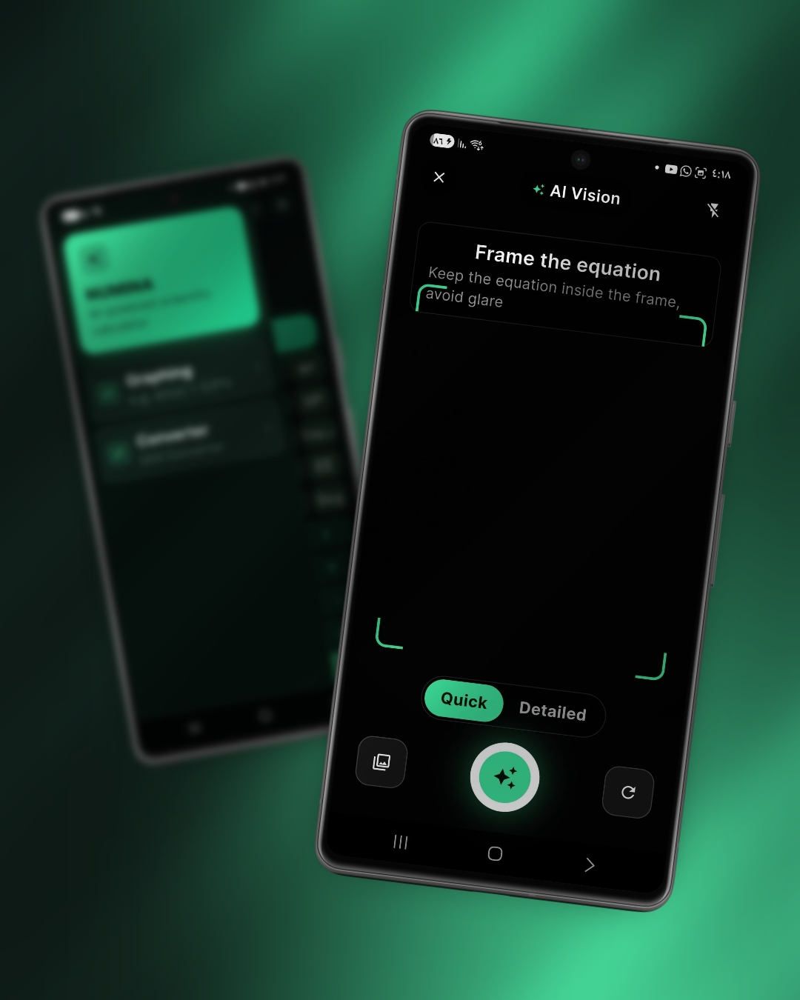
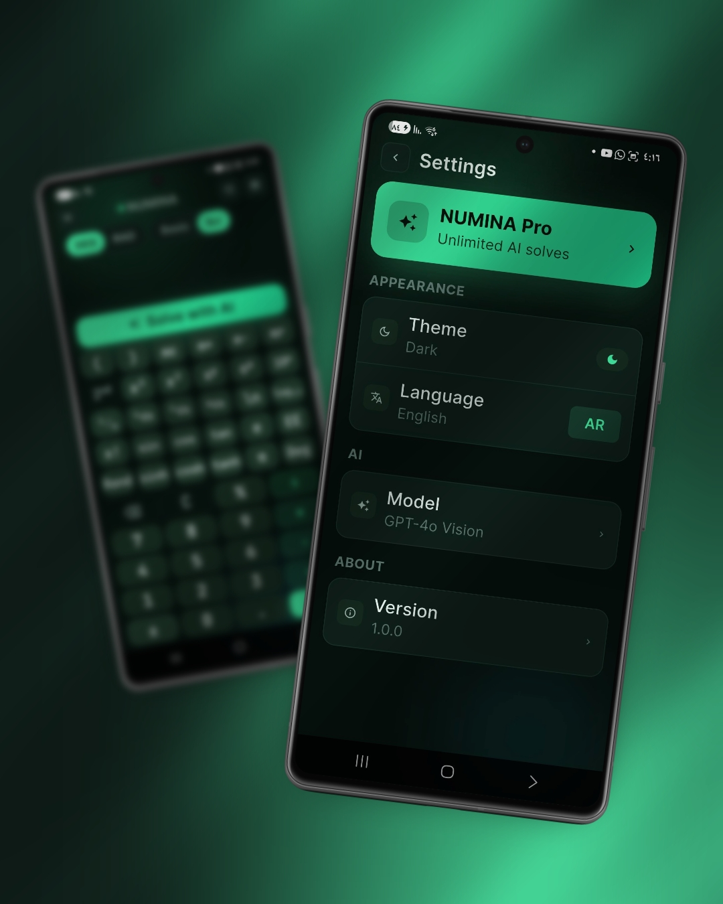
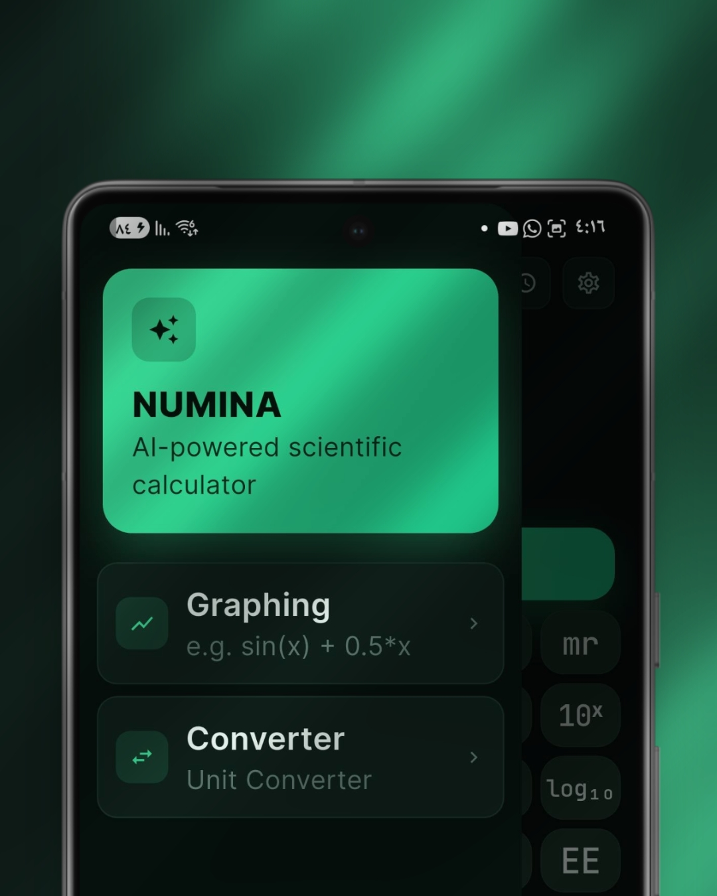

<div align="center">

# ✦ NUMINA

### AI-Powered Scientific Calculator

**A cross-platform scientific calculator that pairs a full scientific keypad with GPT-4o Vision — point your camera at any equation and get a step-by-step solution.**

Built with Flutter • Bilingual (العربية RTL + English) • Privacy-first architecture

<br/>

[](https://flutter.dev)
[](https://dart.dev)
[](https://nodejs.org)
[](https://platform.openai.com)
[]()
[](#-license)

<br/>


</div>

<br/>

---

## ✦ Overview

**NUMINA** is a smart scientific calculator for **Android & iOS**, built from a single Flutter
codebase. It does everything a classic scientific calculator does — and then lets you snap a
photo of a handwritten or printed equation and have **GPT-4o Vision** read it, render it in
LaTeX, and walk you through the solution.

The interface is fully bilingual with **first-class Arabic (RTL)** support and a clean,
dark-by-default design.

> **🔒 Privacy by design** — the app **never** talks to OpenAI directly. Every AI request is
> routed through a lightweight backend proxy, so your API key stays off the device. The
> calculator, grapher, converter, and history all work **fully offline**.

<br/>

## ✦ Screenshots

<div align="center">

| Home — Basic | AI Vision | Settings |
|:---:|:---:|:---:|
|  |  |  |
| Clean keypad with angle mode & **Solve with AI** | Frame an equation → Quick or Detailed | Theme, language & AI model |

</div>

<div align="center">

| Basic & Scientific Keypad | Quick Tools |
|:---:|:---:|
|  |  |
| Full `sin/cos/tan`, `xⁿ`, `√`, `ln`, `log` | Graphing & Unit Converter at a tap |

</div>

<br/>

## ✦ Features

### 🧮 Scientific Calculator
- Basic arithmetic + percentages, sign toggle, nested parentheses
- Full scientific keypad: `sin / cos / tan`, `sinh / cosh / tanh`, `x²`, `x³`, `xʸ`, `√`, `³√`, `ⁿ√`, `ln`, `log₁₀`, `eˣ`, `10ˣ`, `x!`, `1/x`
- Constants: `π`, `e`
- **Angle modes** — Degrees / Radians, switchable inline (DEG · RAD)
- Memory keys (`mc`, `m+`, `m-`, `mr`)
- All math computed **on-device** — fast, accurate, and offline

### 🤖 AI Vision Solver *(the headline feature)*
- Capture from **camera** or pick from **gallery**
- In-app framing screen to keep the equation aligned and glare-free
- GPT-4o Vision extracts the equation as **LaTeX**
- Two solution modes:
  - ⚡ **Quick** — just the answer
  - 📚 **Detailed** — step-by-step explanation
- Results rendered as beautiful LaTeX

### 📈 Function Grapher
- Plot any `f(x)` (e.g. `sin(x) + 0.5*x`) with `fl_chart`

### 🔄 Unit Converter
- Length, weight, time, angle, speed

### 🗂️ History
- Local persistent history (Hive) with pin / delete

### ⚙️ Personalization
- Light / Dark / System theme
- Language toggle — **العربية ↔ English**, with full RTL layout

<br/>

## ✦ Architecture

```
┌──────────────────────┐        HTTPS         ┌──────────────────────┐        ┌──────────────┐
│   NUMINA  (Flutter)  │  ───────────────────▶│   Backend Proxy      │ ─────▶ │  OpenAI API  │
│   Android · iOS      │   image + mode       │   Node + Express     │  key   │  GPT-4o      │
│                      │◀───────────────────  │   (rate-limit/CORS)  │ ◀───── │  Vision      │
│  on-device math      │   latex + steps      │                      │        │              │
└──────────────────────┘                      └──────────────────────┘        └──────────────┘
        🔓 no API key on device                  🔒 API key lives here only
```

The device only ever talks to **your** backend URL — the OpenAI key never ships in the app.

### Repository layout

```
.
├── app/                 # Flutter app (Dart, Material 3, Riverpod)
│   └── lib/
│       ├── core/        # theme, router, network, constants, errors
│       ├── features/    # calculator · ai_solver · graphing · history · settings · unit_converter
│       │   └── <feature>/{data,domain,presentation}
│       ├── l10n/        # ar / en localization
│       └── shared/      # shared widgets
├── backend/             # Node + Express proxy for the OpenAI API
│   └── src/server.js
└── Images/              # marketing / README mockups
```

### Tech stack

| Layer | Technology |
|---|---|
| **Frontend** | Flutter (Dart, Material 3) |
| **State** | Riverpod |
| **Routing** | go_router |
| **Math engine** | `math_expressions` |
| **LaTeX** | `flutter_math_fork` |
| **Charts** | `fl_chart` |
| **Local storage** | Hive · `shared_preferences` |
| **Camera / images** | `camera` · `image_picker` |
| **Backend** | Node 20+ · Express · helmet · cors · express-rate-limit · zod |
| **AI model** | OpenAI **GPT-4o Vision** |
| **i18n** | `flutter_localizations` · `intl` |

<br/>

## ✦ Getting Started

### Prerequisites
- [Flutter SDK](https://docs.flutter.dev/get-started/install) **3.11+**
- [Node.js](https://nodejs.org) **20+**
- An [OpenAI API key](https://platform.openai.com/api-keys) *(only needed for the AI Vision feature)*

### 1 — Run the backend proxy

```bash
cd backend
cp .env.example .env          # then edit .env and set OPENAI_API_KEY
npm install
npm start                     # production  → http://localhost:5000
npm run dev                   # auto-reload
```

The proxy exposes:

| Method | Endpoint | Body | Returns |
|---|---|---|---|
| `GET` | `/health` | — | `{ ok: true }` |
| `POST` | `/solve` | `{ imageBase64, mode: "quick"\|"detailed", lang: "en"\|"ar" }` | `{ latex, answer, steps[] }` |

### 2 — Run the app

```bash
cd app
flutter pub get
flutter run --dart-define=BACKEND_URL=https://your-proxy.example.com
```

> Without `BACKEND_URL`, the calculator, grapher, converter, and history work fully —
> only the **AI Vision** tab shows a banner saying the backend isn't configured.
> The app never falls back to calling OpenAI directly.

### Tests

```bash
cd app     && flutter test    # Flutter widget / unit tests
cd backend && npm test        # backend tests
```

<br/>

## ✦ Building for Release

```bash
# Android APK
cd app && flutter build apk --release \
  --dart-define=BACKEND_URL=https://your-proxy.example.com

# iOS (macOS only)
cd app && flutter build ios --release \
  --dart-define=BACKEND_URL=https://your-proxy.example.com
```

<br/>

## ✦ Roadmap

- [ ] Symbolic calculus (differentiation & integration)
- [ ] Equation & system solvers
- [ ] Matrix operations (transpose, inverse, determinant, eigenvalues)
- [ ] Statistics & linear regression
- [ ] Number-base conversion (DEC / BIN / OCT / HEX)
- [ ] PDF export of solutions
- [ ] Cloud history sync
- [ ] More languages

The clean `features/<feature>/{data,domain,presentation}` structure is set up to keep adding
capabilities without churn.

<br/>

## ✦ Security

- The OpenAI API key lives **only** in the backend `.env` — never in the client build.
- The backend enforces **rate limiting**, a **CORS allowlist**, and security headers (**helmet**).
- `.env`, signing keys, and keystores are git-ignored. **Never commit secrets.**

<br/>

## ✦ License

Released under the **MIT License**. See [`LICENSE`](LICENSE) for details.

<br/>

<div align="center">

**Made with Flutter & a lot of ☕**

<sub>NUMINA — where numbers meet intelligence.</sub>

</div>
